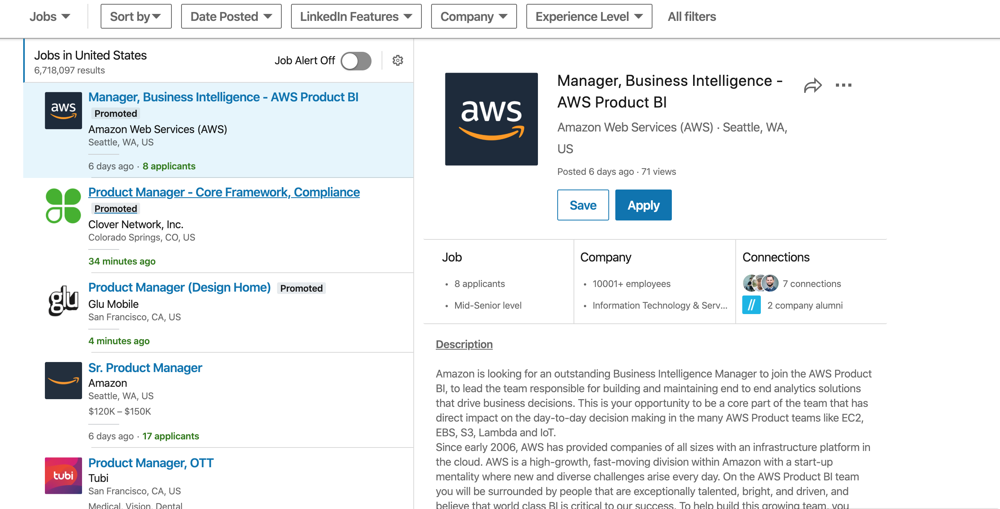

# User Stories

## Alumni

1. As a `Alumni User` visiting the website, I should see a page with links a logo and an alumni log in/sign up button, The page should be pleasant to look at and clear about where links go and it should be clear that the log in and sign up are for alumni only.
2. As a `Alumni User` clicking signup, I should be presented a form asking for
   1. email
   2. full name
   3. cohort
   4. password with confirmation

   so that i may register for an account and await confirmation from an admin.
3. As an `Admin`, I should be able to confirm that users have graduated by checking a box, this will allow us to make sure that only students who have gratuated can post.
4. As an `Admin`, After checking the box there should be an email sent to the `Alumni User` notifying them that they now have access to post the information about their Mod 5 project.
5. As a registered `Alumni User`, I should recieve an email informing me that I can now fill in the information about my project, this email should tell the user how to post their information.
6. As a registered `Alumni User`, I should be able to click Log in, Logging in should ask for my email and password.
7. As a logged in `Alumni User`, on first login I should be presented a Form, So that I can fill out all the information about my project.
8. As a logged in `Alumni User`, The form should ask for

   Required *

   Only one required but can have both **

   1. My name *
   2. A link to My linkedIn profile *
   3. A link to My personal portfolio website
   4. A link to My Github profile page *
   5. A link to My Deployed Application **
   6. A link to a walkthrough of final project video hosted on Youtube **
   7. A description of application *
   8. A dropdown with different technologies (react native,JWT, Redux, Mobile first Design, CSS ...)
  
9. As a logged in `Alumni User`, after submitting the form the page should redirect me to my portfolio page, this will allow the user to see what the finished product looks like.
10. As a logged in `Alumni User`, on my portfolio page I should see a button to edit the page, This should only be visable on my page and only if im logged in.
11. As a logged in `Alumni User`, after clicking the edit button the form should appear and I should be able to make any edits I choose to.

## Admin

1. As a `Developer`, I will make an admin account, the admin will have access to more routes than a typical user.
2. As a `Developer`, I will give Admin the ability to make other admin accounts.
3. As an `Admin`, I should be able to click a button `add admin`, which allows you to type in an email or multiple emails that gets sent to staff with admin permissions.
4. As an `Admin`, I should have a "pending" notification that tells me there are students waiting to be approved, This will allow quick access to the apporval page which has "pending" students in a table with a graduated checkbox.
5. As an `Admin`, I should be able to confirm that users have graduated by checking a box, this will allow us to make sure that only students who have gratuated can post.
6. As an `Admin`, After checking the box there should be an email sent to the `Alumni User` notifying them that they now have access to post the information about their Mod 5 project.
7. As an `Admin`, I should have access to a Master Alumni page, that lists all of our graduated alumni in a table with their name, cohort, link to portfolio page, and hired checkbox.
8. As an `Admin` and as an `Alumni User`, If I click the box hired there should be a text feild pop up that lets me list where the alumni was hired, This would take the user out of the currently looking pool and put them in a hired pool.
9. As an `Admin`, I should be able to edit or delete portfolios, this will help us moderate the material that is posted.

## General Users

1. As a `General User`, on the home page it should be clear that I am not meant to log in or sign in, as a general user I am meant to browse without making an account.
2. As a `General User`, on the home page I should see some links that open in another tab
   1. <https://flatironschool.com/campuses/seattle>
   2. <https://www.eventbrite.com/e/campus-tour-flatiron-school-seattle-tickets-59972606681>
   3. <https://www.eventbrite.com/e/open-house-open-lab-tickets-68647258799?aff=website>
   4. <https://www.meetup.com/Seattle-FlatironSchoolStudy/>

3. As a `General User`, I should see a "promoted" Profile, That cycles through all profiles either randomly or one by one.
4. As a `General User`, I should see a button `Profiles`, that takes me to a list of all profiles it should be sortable think this 
5. As a `General User`, I should be able to scroll down through all users seeing a preview on the right of their application, this will allow the user the ability to browse the alumni quickly.
6. As a `General User`, I should be able to click on the preview on the right to full screen that profile, this would allow the user to view more information.
7. As a `General User`, there should be a button to take me back to the pictured view.
8. As a `General User`, the sort by at the top should allow me to sort by
   1. available (not hired)
   2. Hired (If someone wanted to see where people were hired)
   3. technologies (React Native, JWT, Mobile first design etc...)

## Endpoints

This is an example and doesn't exist yet make it similar to this

flatiron-showcase.herokuapp.com/api/v1/seattle
